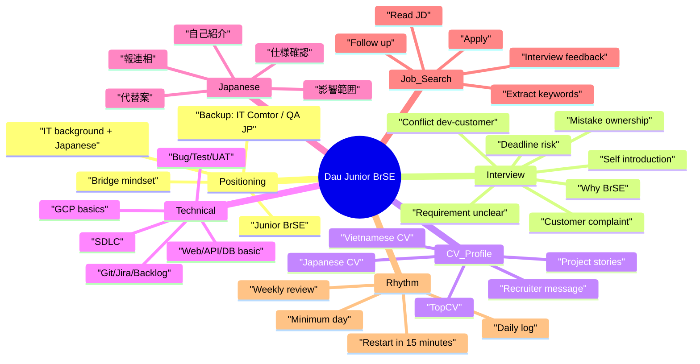

# BrSE Interview Sprint

> Sprint note hien tai cho muc tieu Junior BrSE. Giu ngan, de doc, de chuyen vao Notion khi can.

---

## Goal

**Dream target:** Junior BrSE  
**Backup co chien luoc:** IT Comtor Technical / QA Tester JP trong du an Nhat  
**Target ready date:** 2026-07-14

Muc tieu khong phai lap plan dep, ma la tao bang chung nho moi ngay: luyen noi, sua profile, doc JD, apply/nhan recruiter, va review feedback.

---

## Sprint Map

---

## Active Files

- `05-career-prep/2026/mock-interviews/brse-answer-bank.md`
- `05-career-prep/2026/mock-interviews/brse-self-intro-active.md`
- `05-career-prep/2026/daily/2026-06-16.md`

---

## Archived References

May plan cu van giu lai de tham khao, nhung khong dat o mat tien nua:

- `05-career-prep/2026/archive/legacy-2026-05-brse-prep/SPRINT-PLAN-2026-05-28.md`
- `05-career-prep/2026/archive/legacy-2026-05-brse-prep/GCP-BRSE-2W-PLAN-2026-05-31.md`
- `05-career-prep/2026/archive/legacy-2026-05-brse-prep/IMPROVEMENT-AREAS.md`
- `05-career-prep/2026/archive/legacy-2026-05-brse-prep/KINKEN-KNOWLEDGE-BASE-CHECKLIST.md`
- `05-career-prep/2026/archive/legacy-2026-05-brse-prep/MOCK-INTERVIEW-SCHEDULE.md`

---

## Minimum Day

Ngay te cung chi can xong 3 viec:

- [ ] Noi 1 cau phong van trong 3-5 phut.
- [ ] Sua hoac viet 1 dong CV/profile/answer bank.
- [ ] Lam 1 hanh dong job search: doc 1 JD, apply 1 job, hoac nhan 1 recruiter.

Neu mat nhip: mo file nay, lam lai 15 phut, khong can "bat dau lai tu dau".

---

## Weekly Focus

| Week | Dates | Focus | Done When |
|---|---|---|---|
| Week 1 | 2026-06-16 to 2026-06-22 | Rebuild rhythm + self-intro + core mindset | Co daily log toi thieu 4 ngay, noi duoc 自己紹介 60-90s |
| Week 2 | 2026-06-23 to 2026-06-29 | Answer bank + CV/profile | Co 10 cau BrSE, CV/TopCV duoc polish |
| Week 3 | 2026-06-30 to 2026-07-06 | Mock interview + job search loop | Mock 3 lan, apply deu, ghi feedback |
| Week 4 | 2026-07-07 to 2026-07-14 | Polish + interview-ready | Co bo answer on dinh, san sang phong van |

---

## Daily Workflow

1. Mo file sprint hien tai hoac Notion dashboard.
2. Mo daily log hom nay trong `05-career-prep/2026/daily/`.
3. Chon 3 task nho theo muc "Minimum Day".
4. Lam xong thi tick, ghi 2-5 dong ket qua.
5. Neu can feedback, dua daily log hoac cau tra loi cho Codex review.

---

## Current Priority

- [ ] Luyen `brse-self-intro-active.md` ban ngan 60-90 giay.
- [ ] Tao va cap nhat `brse-answer-bank.md`.
- [ ] Tim 3 JD Junior BrSE / IT Comtor Technical / QA JP de rut keyword.
- [ ] Cap nhat CV theo role Junior BrSE.
- [ ] Tao Notion job pipeline neu can track apply status.
